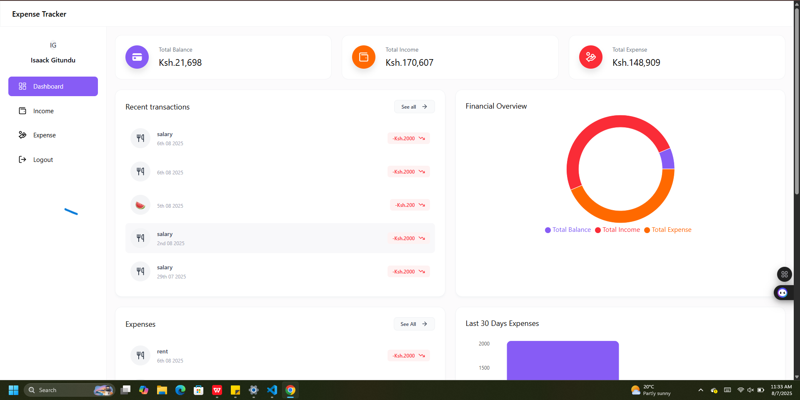
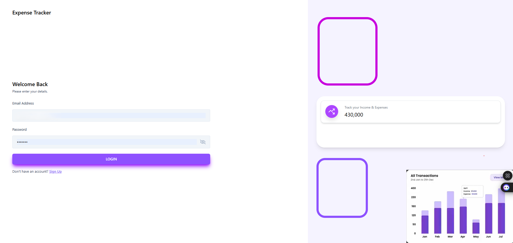
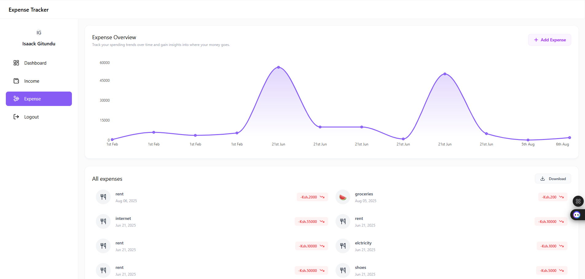
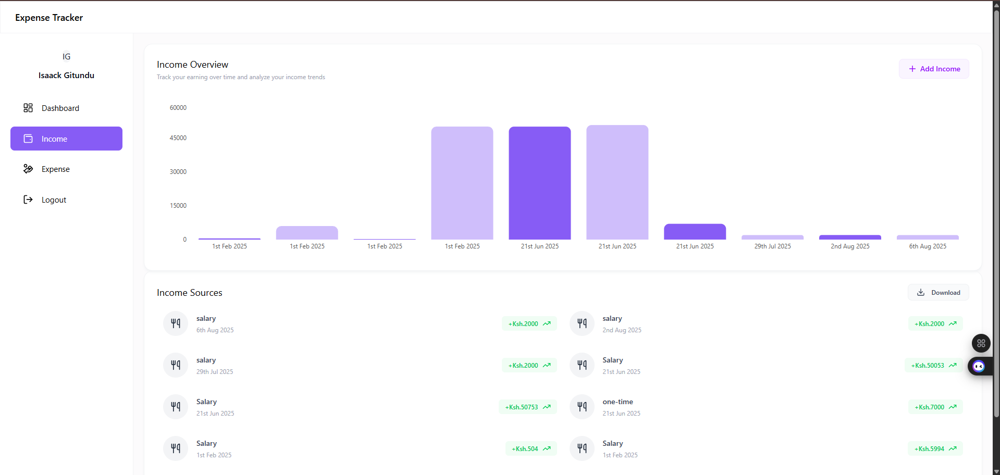

# 💰 Expense Tracker App

A full-stack Expense Tracker web application that helps users record, manage, and visualize their expenses in a simple and intuitive interface.

---

## 📸 Screenshots







---

## ✨ Features

- 🔐 User Authentication (Login & Signup)
- 🧾 Add, Edit, and Delete Transactions
- 📊 Line Chart Visualization of Spending
- 📅 Filter by Month and Year
- 📁 Organized by Transaction Type (Income/Expense)
- 🌐 Fully Responsive Design
- 🇰🇪 Currency Display in KES (Kenyan Shilling)

---

## 🛠 Tech Stack

**Frontend:**

- React.js (with Vite)
- Tailwind CSS
- Recharts (for charting)
- React Router DOM

**Backend:**

- Node.js + Express
- PostgreSQL + Prisma/Drizzle ORM (choose what you're using)
- JWT Authentication

---

## 🚀 Getting Started

### Prerequisites

- Node.js (v18+)
- MongoDb
- Git

Explore project: https://aizooh.github.io/expense-tracker/login
### Clone the Repository

```bash
git clone https://github.com/your-username/expense-tracker.git
cd expense-tracker
